# Google Assistant SDK Demo: Mocktails Mixer Gizmology 2023

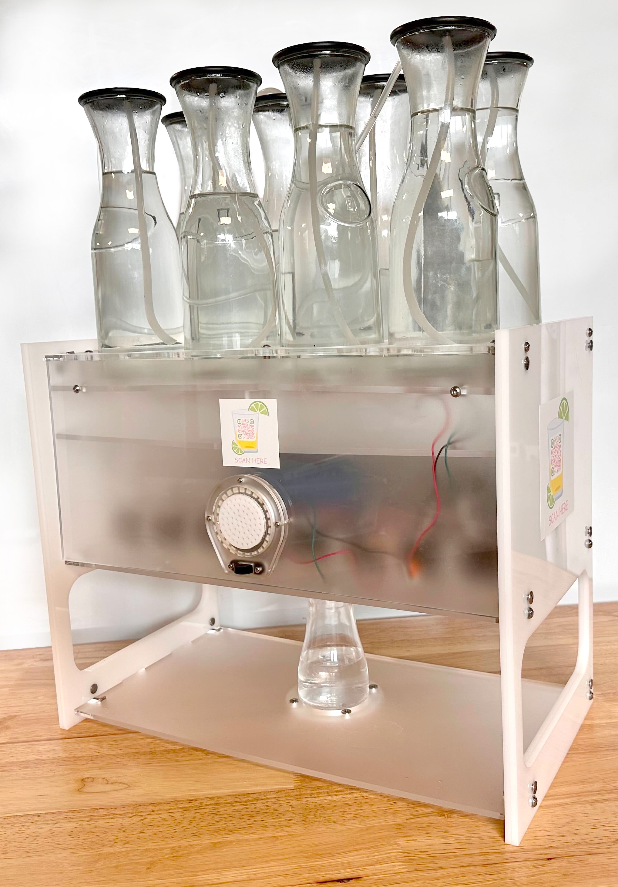

## Make a DIY robotic mocktails mixer with the Google Assistant built in.
##In the Spring of 2023, innovation studio and experiential design firm Deeplocal launched Gizmology, a one-year creative technology apprenticeship program for recent high school graduates and underemployed adults in Pittsburgh’s Black community. Supported in part by Deeplocal’s parent company WPP’s racial equity committments, Gizmology’s goal was to advance racial equity in creative and technical fields through on-the-job training and mentorship. Through an initial upfront classroom training spanning nearly four months the Gizmology apprentices, or Gizmos as they affectionately named themselves, learned the foundational skills related to 3D design, electrical engineering, physical computing, fabrication methods (laser cutting/welding/woodworking), and creative technology. Designed as two semesters, Gizmology 1 and Gizmology 2, each semester culminated with a capstone project; the final capstone for the classroom training was to ‘re-create’ a robotic mocktails mixer with Google Assistant built in. 

In mid-July, after weeks of interdisciplinary training and exposure, each of the Gizmos chose an apprenticeship track and set-out to complete the final capstone project fulfilling their specific roles. Jason focused on exhibit fabrication, Jordan delved deeper into technical integration, and Justin focused on Mechanical Design, with each pitching in to work as a team and support the assembly. For Creative Tech, Imani and Mecca shared the responsibility of updating and converting the SDK from Python to Node.Js as it was no longer valid; this was no small feat and an amazing accomplishment for a beginning creative technologist. For all the Gizmos, it was evident that the recreation of the robotic mocktails mixer with Google Assistant wasn’t simply going to be a matter of merely following directions, it was going to take creativity, ingenuity, and most importantly- the real world application of the skills they learned to successfully recreate the project as a team. What you’ll see below is the journey of the Gizmos to create the “Gizmology Mocktails Mixer”, complete with six uniquely designed mocktails (from eight different flavors) representing personal connections to each member of the Gizmology team. This DIY robotic home bartender whips up your favorite mixed drinks at your command–in the true spirit of the Gizmos!

**Disclaimer:** THESE INSTRUCTIONS ARE BEING PROVIDED FOR INFORMATIONAL PURPOSES ONLY AND ARE NOT INTENDED TO BE USED FOR THE PRODUCTION OF COMMERCIAL PRODUCTS.  BY EXECUTING THESE INSTRUCTIONS, YOU AGREE TO ASSUME ALL LIABILITY IN CONNECTION WITH YOUR BUILDING AND USE OF ANY DEVICE. DEEPLOCAL DISCLAIMS ALL WARRANTIES EXPRESS OR IMPLIED WITH RESPECT TO THESE INSTRUCTIONS AND ANY RESULTING DEVICE INCLUDING BUT NOT LIMITED TO WARRANTIES FOR MERCHANTABILITY, FITNESS FOR ANY PARTICULAR PURPOSE, AND NON-INFRINGEMENT.  YOU SHOULD USE EXTREME CAUTION WHEN BUILDING AND USING ANY DEVICE PURSUANT TO THESE INSTRUCTIONS.  IN NO EVENT SHALL DEEPLOCAL BE LIABLE FOR ANY CLAIM OR DAMAGES, INCLUDING BUT NOT LIMITED TO CLAIMS OR DAMAGES RELATED TO DEATH OR PERSONAL INJURY, PROPERTY DAMAGE, OR PRODUCT LIABILITY.

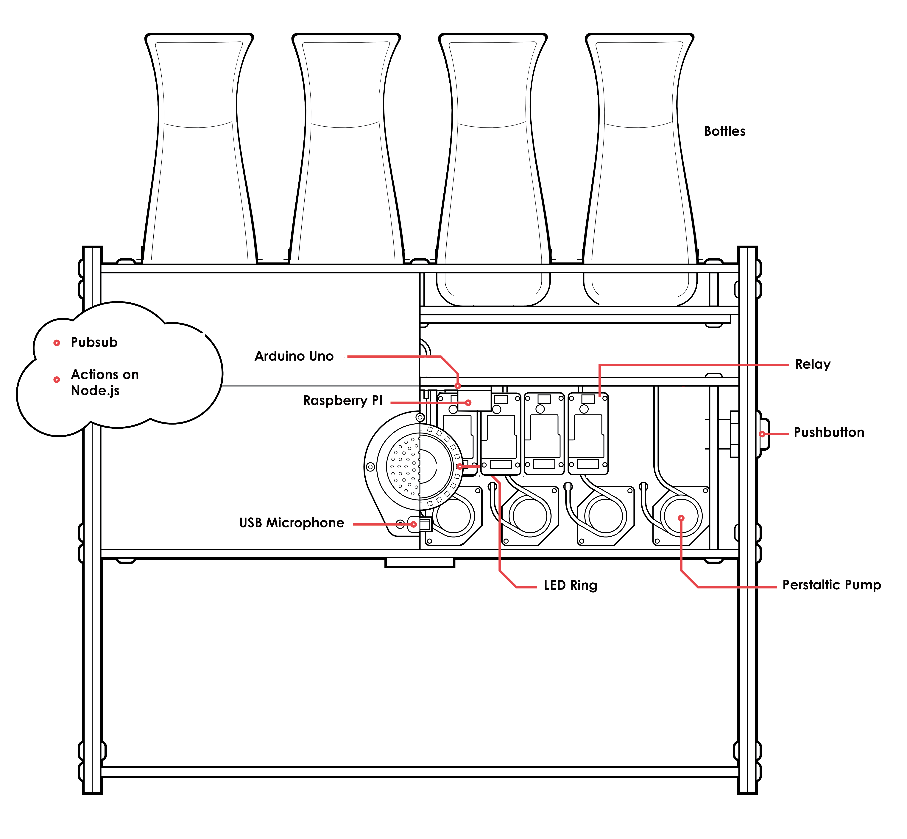

**Features:**

- Voice-controlled drink ordering 
- Modular design allows you to customize your Mixer to include as many ingredients and drink combinations as you choose

## What You’ll Find
- diagrams/
- hardware/
  - cad/
  - laser-cut/
  - photos/
  - bill of materials
- software/
  - arduino/
  - rpi/
  - gcf/
  - api.ai agent zip

## What You'll Need
Before you get started, you should have a basic knowledge of soldering. You should also have access to a laser cutter.
You can find all of the parts we used, along with the exact quantity, supplier, cost, and links to purchase [here](hardware/bom.pdf).
Note: In general, we used parts that were readily available, but on the expensive side. This build could be completed with less expense if parts are sourced on Amazon/Alibaba or if lower quality parts are used.
Note: All materials used in this build are rated as “food safe.” Liquid does not come in contact with any material that is not food grade safe.

### Tools needed for the build are listed below:
- Hand drill
- Rubber mallet or hammer
- Screwdriver set
- X-ACTO knife
- Soldering Iron
- Wire cutters
- Wire strippers
- Scissors
- Hex Key Set
- Wrench Set

## Building the Mixer Body

### Step 1: Laser Cutting
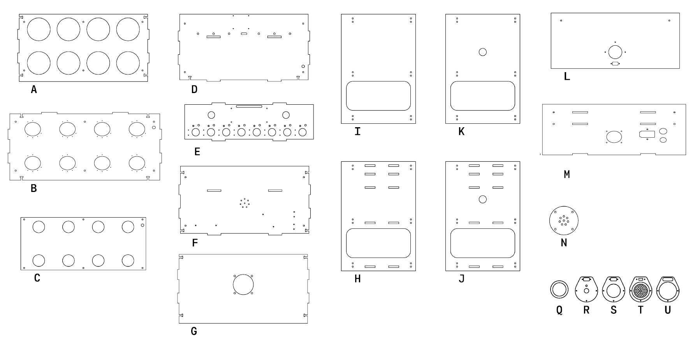

#### Laser cut all 2D profiles into the acrylic sheets.
Note: DFXs are all in inches. Please scale according to input of the laser cutter. See attached drawings for design guidance.
- A. Top Panel- ¼ inch thick
- B. Bottle Capture Panel- ¼ inch thick
- C. Lid Capture Panel- ¼ inch thick*
- D. Drip Panel- ¼ inch thick
- E. Pump-Relay Control Panel- ¼ inch thick*
- F. Pour Panel- ¼ inch thick
- G. Bottom Panel- ¼ inch thick
- H. Inside Side Panel- ¼ inch thick
- I. Outside  Side Panel-¼ inch thick
- J. Inside Side Button Panel-¼ inch thick
- K. Outside SIde Button Panel- ¼ inch thick
- L. Front Panel- ¼ inch thick
- M. Rear Panel- ¼ inch thick*
- N. Cup Indicator Panel- 1/16 inch thick
- O. Arduino Top Plate- 1/16 inch thick 
- P.  Arduino Bottom Plate- 1/16 inch thick
- Q. Speaker Diffusion Level
- R. Speaker Clear Level 16th- 1/16 inch thick
- S. Speaker Black Level 8th- ⅛ inch thick
- T. Speaker Black Level 8th 1- ⅛ inch thick
- U. Speaker Black Level 4th 1- ¼ inch thick

*Panels that were revised include:
Lid Capture Panel- needed holes for the light wire
Pump Relay Control Panel- CAD mount holes for brackets. CAD holes for wires from pumps to power and access for tubes to run through, holes for the relay to be mounted
Rear panel- CAD holes for mounting a fan 

*Note: We highly recomend a cardboard prototype. 

### Step 2: Assemble Bottle Holder Sub
Attach Top Panel with Bottle Capture Panel together with #10-32 x 1/2 inch length button socket cap and #10-32 x 1 inch length ¼ OD standoff.

On the other side, with Lid Capture Panel use 10-32 x ¾ inch length button socket cap fasteners (Optional - Double sided tape can be used to attach the Lid Capture Panel to the bottom of the Bottle Capture Panel).

Note: There is a ¼ inch overhang on the Top Panel. Rear panels are flush with the exception of the tabs.

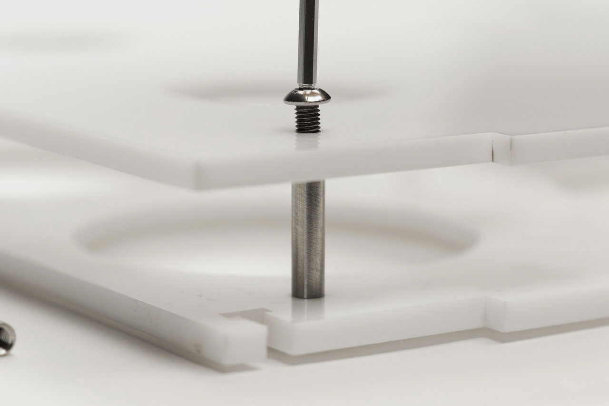

### Step 3: Assemble Pump and Relay Control Panel Sub
Note: To ensure pump tubing is food grade safe, please replace with Tygon Clear PVC tubing 3/32 inch ID x 5/32 inch OD (Hardness rating is “Soft” and durometer is 65A). The durometer is imperative to pump and tube life. This can be found on McMaster-Carr.

#### Install Food Grade Pump Tubing.
Remove cover from pumps by depressing snaps on both sides of pump head. Remove tubing that was placed in during shipment. Place food grade tubing into pump allowing 3 inches to remain outside the inlet and outlet of the pump. Also, be careful to not puncture the tubing when installing around the rollers.

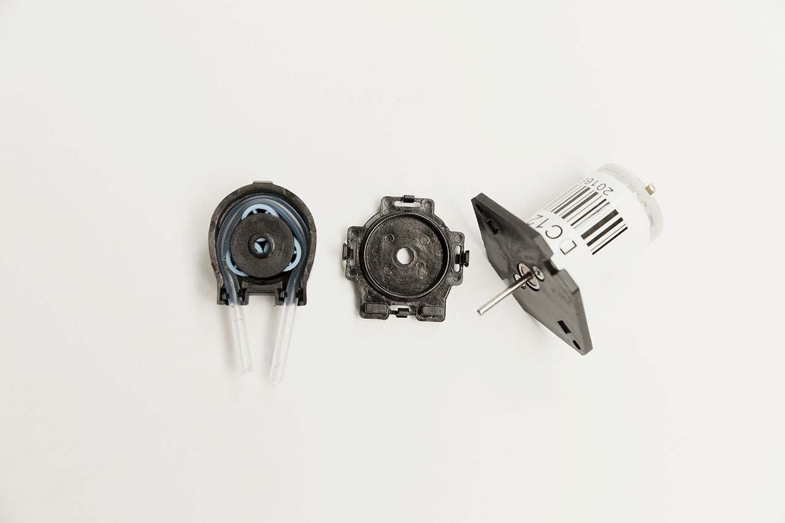

#### Attach Pumps.
The pumps that were available required brackets to be mounted. Brackets were created in solidworks and 3D printed. 

Use the Pump/Relay Control Panel and attach the brackets to the eight 1.10 inch diameter holes located on the panel. Place a #8 black rubber washer between the bracket and acrylic to reduce vibration.
Use a #2-56 x ½ inch length Phillips pan head machine screw and corresponding nut to fasten the brackets to the acrylic. Use the same screws and nuts to attach the pump to the bracket.

#### Attach Relay Module.
In this version, to save time, we have used an 8 channel
Relay module. Attach the 8-Channel Relay Module directly above each pump on the Pump/Relay Control Panel. There will be a 4 bolt hole pattern. Use the #2-56 x ⅜ inch length ⅛ inch OD standoffs (Optional - You can use #2-56 x 1/2 inch length Phillips pan head machine screw and corresponding nut instead of the standoffs.) with number #2 washers underneath each hole before the standoff. Fasten each corner with a #2-56 x 5/32 inch length Phillips pan head machine screw.  Note that the red led must be positioned toward the top of the acrylic sheet. Use a #2-56 x ⅜ inch length pan head Phillips machine screw and fasten relays from other side of acrylic.

Tip: When attaching the fasteners, washers and standoffs to the relay module, allow them to be loose. This will help with easy alignment to the corresponding holes on the acrylic than retighten fasteners on relays.

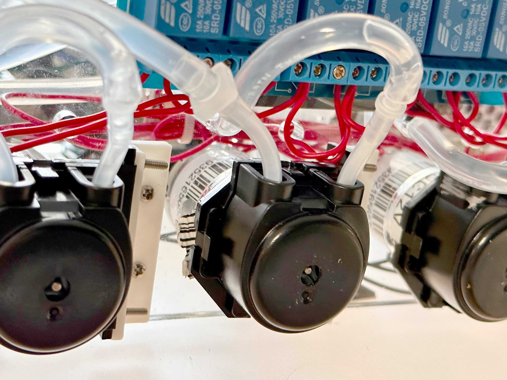

#### Attach Arduino Uno and Arduino Mount.
You can 3D print an Arduino Uno mount by using this link to download the file from GrabCAD. We used a Bambu Studio P1P 3D printer. The file takes about 6 minutes to print in total.

Place the Arduino on the mount, matching the holes on the Arduino to the corresponding holes on the mount. Use screws to secure the Arduino onto the mount. Attach the Arduino and the mount onto the back of the pump panel with VHB. You should leave enough room for the the wires from the relay to come through the slot and attach to the pins on the Arduino Uno.

#### Attach Raspberry Pi to Drip Panel.
Attach the Raspberry Pi to the back panel using velcore. 

## Wiring the Electrical System

#### Electrical System Overview

For a clearer view of the wiring diagram download the [fritzing file](diagrams/wiring_fritzing.fzz).

#### Control
The electrical system of the Mocktails Mixer uses two control systems. The first is a Raspberry Pi, which handles all of the communication with the Google Assistant SDK. The second is an Arduino Micro that controls the pumps and LEDs. Both of these systems are connected to each other over serial. The Raspberry Pi sends commands to the arduino about what lights and pumps to turn on and the Arduino executes them.

Outside of these two controllers, the Mocktails Mixer has four major hardware systems. They are Power, the Pumping system, Lights, and Audio.

#### Power
The power system controls the flow of electricity in the Mixer. However, the Mixer uses two different voltages: 12V for the pumps and 5V for the other hardware. You can handle this by using a step-down voltage regulator or a dual-voltage power supply. These are both adequate for the basic build of the Mixer, but if you want to add extra flair (like more LEDs),  you may need to use two separate power supplies. Our instructions and BOM use two power supplies.

Note: For safety, we recommend placing the power supply in an external enclosure to keep 110V away from the liquids in the mixer.

#### Pumps
In this version of the Mocktails Mixer, we used eight (8) peristaltic pumps. These are rated and recommended for use at 12V, but you can run them up to 24V if you find that the pumps are running too slow. The pumps are all individually switched by a relay controlled by the Arduino Uno.
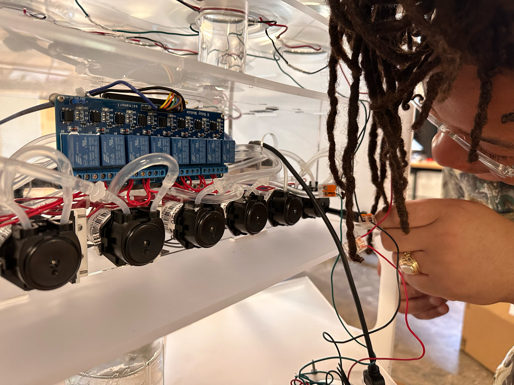

#### Lighting
For visual feedback, we added an LED ring to the Mixer. We used the Adafruit Neopixel. It is very easy to wire and add additional rings, plus the library is easy to use. These draw a decent amount to amperage, so if you want to add more to your build, you will need to size your 5V power supply accordingly.

#### Audio
Last but not least, we used a USB Microphone to speak and order drinks that is connected directly to the Raspberry Pi. We chose to not connect the speaker. If we did, the speaker could be connected to the amplifier on the Arduino’s mounting plate. The amplifier is connected to the Raspberry Pi via a 3.5 mm headphone jack.

## Electrical System Wiring Instructions

### Step 4: Wire the Power Supplies
To wire the power supply, first connect the AC Lines to their terminals (Black to L or Load, White to N or Neutral, Green to Ground). Next, connect the DC power lines to power supplies.
Note: To make the wiring easier to follow, we used red wire for all the 12V lines and green for all of the 5V lines. We kept the all of the Ground wires black because all devices will need to share Ground in order to communicate.
Note: We also recommend using a lower gauge wire (12 or 14 gauge), for the DC power lines moving from the power supply to the terminal block or the wire nut, then using a higher gauge (20 to 24 gauge) for all of the other lines.

Note: The pumps used in this assembly produce a lot of ground noise that can travel throughout the dinrail and could potentially interfere with communication between Raspberry Pi and Arduino to carry out commands properly. It is recommended that you add a 5k capacitor to the dinral with the long side going into the 12V supply and the short side going to ground to store the ground noise and resolve communication interference. 

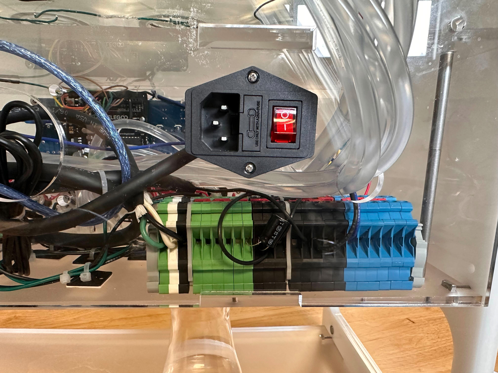

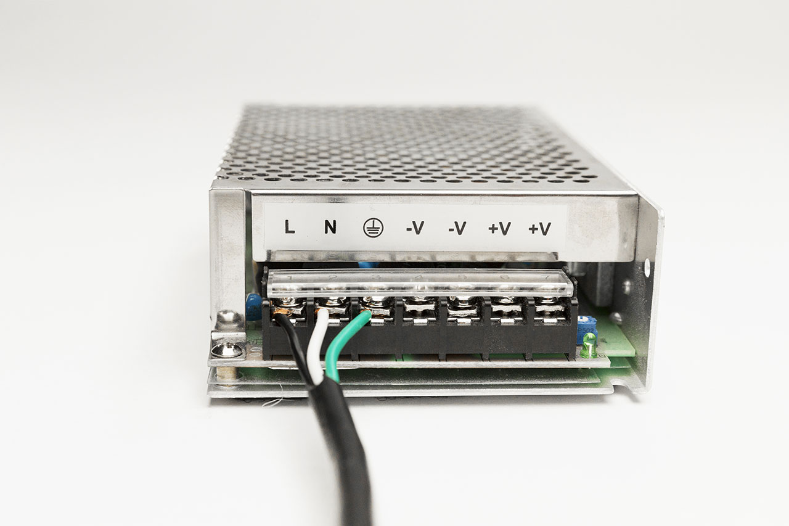

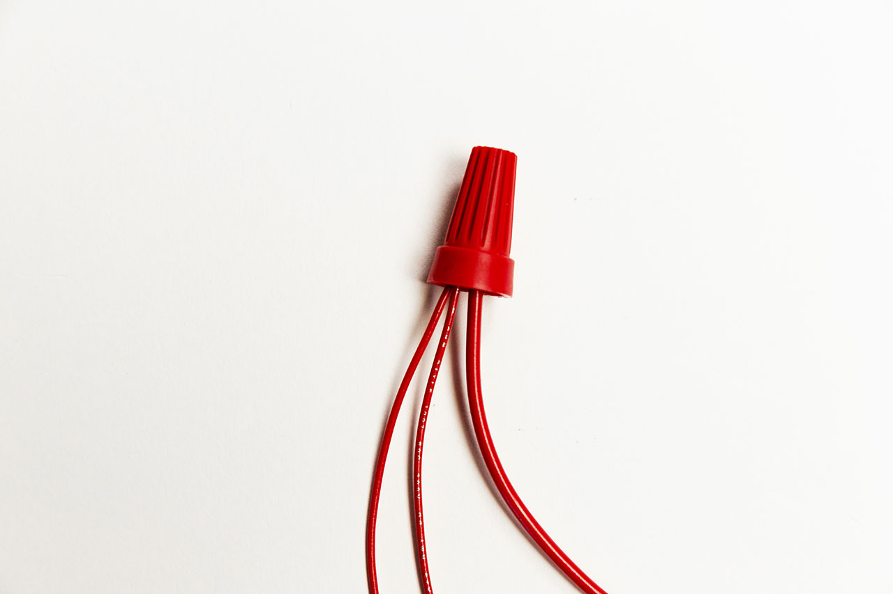

### Step 5: Wire the Pumps and Relay Module
Before we start to wire the pumps and relays, first assemble the relay module. We used the SainSmart 8-Channel Relay Module for this build and the assembly instructions for it can be found [here](https://docs.sainsmart.com/article/u1jgnz4x6y-8-channel-5-v-relay-module-resource). We like it because it is easy to use and readily available—but cheaper alternatives are available.
Next, mount all of the pumps and relays to Pump-Relay Control Panel.

Now we are ready to wire the pumps and relay module. First connect the 5V lines to the 5V Terminal on the module. We daisy chained the lines across the relays to reduce the amount of wires going to the main 5V terminal.

Similarly to the 5V power, connect the Ground wires to the GND terminals on the relays, also daisy chaining them.
Next, connect the control lines from the CTRL terminal on their respective pins on the Arduino. To make connecting the control lines to the Arduino easier, we waited until they were all plugged in before we mounted the Arduino; this way we could still read the pin locations on the back or reset the Arduino if necessary.

The pin-outs for the Arduino are:
- Pump 1 Relay to Pin 3
- Pump 2 Relay to Pin 4
- Pump 3 Relay to Pin 5
- Pump 4 Relay to Pin 7
- Pump 5 Relay to Pin 8
- Pump 6 Relay to Pin 9
- Pump 7 Relay to Pin 10
- Pump 8 Relay to Pin 11

Note: Do Not use Pin 6 to trigger a relay. We reserved that pin to control the lights because it is the PWM pin on the Arduino.

To provide power to the pumps, connect the 12V lines to the COM terminal on the relay (also daisy-chained), then connect the Positive (red) terminal of the pump to the NO terminal on the relay.

Finally, to wrap it all up, connect the Ground lines to the Negative terminal on the pump.
Since the four pumps on the right side of the Mixer are mounted in reverse, we need to change the rotation of the pump to also be reversed. To do this, we just switch the Ground line to the Positive terminal and the Power line from the relay to the Negative terminal.

### Step 6: Wire the LEDs

Wiring the NeoPixel LED ring is very easy. Just solder our data line from PIN 6 on the Arduino to the DIN pin, then connect our 5V line to 5V and the Ground line to GND.
If you would like to add more LED rings, all you need to do is wire the DOUT from the first ring to the DIN of the next ring. Then, just connect the 5V and grounds on both rings together.

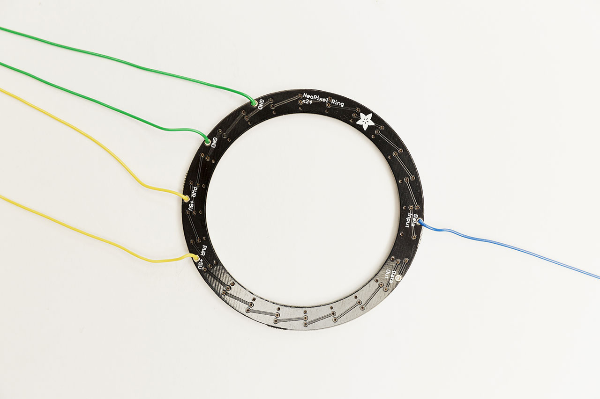

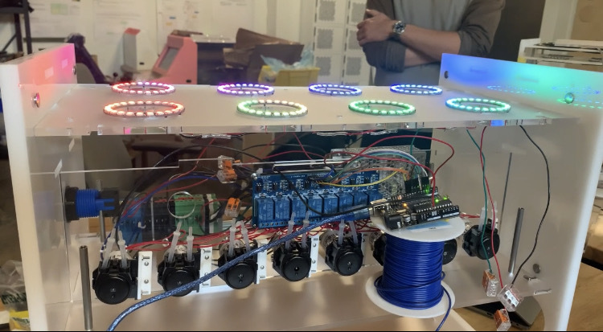

### Step 7: Wire the Audio
Since the microphone is USB controlled, there is no wiring necessary.

### Final Connections
To power the Raspberry Pi, connect a Ground line to a ground pin on the Pi, then connect a 5V line to the 5V in on the Pi.

To activate the voice command, there is a button on the side for you to push. To wire this button, connect the COM terminal to the 3.3V Out on the Raspberry Pi. Then, connect the NO terminal on the button to the button’s respective GPIO (in our case GPIO 7). For a cleaner signal, connect a resistor between the NO terminal and Ground.

Double check the wiring. Trace all of them from each piece of hardware to their source. Once you feel good about the wiring, go ahead and power up the system. The Raspberry Pi should have a red power light visible and the Arduino should have a blue power light visible as well.

## Building the Mixer Body Continued

### Step 8: Assemble Pump Control Center Sub
Assemble Pump/Relay Control Panel between Drip Panel and Pour Panel with corresponding tabs and slots on each sheet of acrylic. Make sure the pumps and relays that face the front of the unit are in front of the pour holes in the center pour plate.
Use 10-32 standoffs and 10-32 fasteners to bring the sub-assembly together. A #10-32 X ½ inch length of all thread will be used to bring the #10-32 X 2 inch length standoff and #10-32 X 3 inch length standoffs together.

### Step 9: Assemble Side Panel Sub
Attach Outside Side Panel to Inside Side Panel using the #8-32 binding posts (Optional - You can omit these from the build. They help with holding the side panels together while assembling). The flat side of the binding post should face the Inside Side Panel. Six of the binding posts will be used per Side Assembly.
Repeat with Inside Side Button Panel and Outside Side Button Panel. The side panel assembly with the button will be on the right side of the unit when looking at the unit from the front.

### Step 10: Assemble Cup Indication on Bottom Panel
Attach Cup Indicator Panel to Bottom Panel with #8-32 Low Profile Binding Barrels. (Optional - Cup indicator helps a user where to place their cup but is not necessary in the assembly).

### Step 11: Bring all the Sub-Assemblies Together

Begin by laying a Side Assembly on its face with slots facing upwards. This will allow for easy installation of the other components.

Attach Bottle Holder Sub-Assembly to the top of the Side Panel Assembly by aligning the slots. Note that the tabs in the rear must face the rear of the unit.

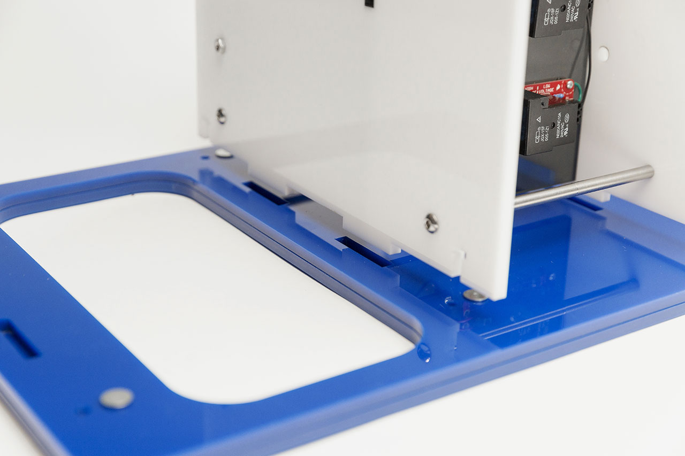

Next, attach the Pump/Relay Control Panel Sub-Assembly right below the Bottle Holder Sub-Assembly, noting that the tabs will align like before. Note that the pumps must be facing towards the front of the unit and the electric motor faces the rear. The front of the unit can be determined by the amount of space between the slots and the edge of Side Panels—the larger gap indicates the front of the unit.

Attach the Bottom Panel to the last two remaining slots towards the bottom of the Side Panel Assembly.

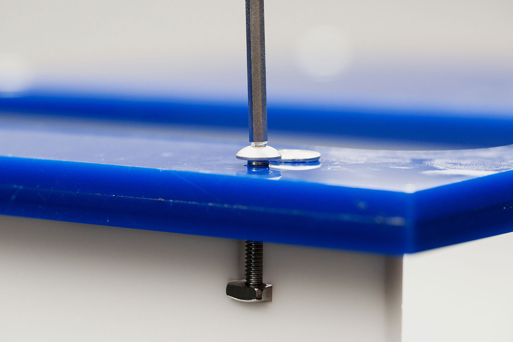

Attach the other Side Panel Assembly, mating all tabs and slots. Use the #10-32 X 1 inch length button socket cap and corresponding square nuts to secure the unit. There are six of these per side.

Rotate the unit 180 degrees and fasten the other six fasteners. Tip: Be careful when rotating the unit and make sure to firmly hold the two side panel assemblies together. A second person may be helpful here.

### Step 12: Cut and Fit Fluid Delivery Tubes to Length and Install
Begin by taking the ¼ inch OD tubing (food safe) and run it from each pump up through the holes in the Drip Panel. Leave an additional 8-10 inches of extra tubing to easily remove a bottle.

Next using the tube connectors run the ¼ inch OD tubing (food safe) from the pump outlet to the pour holes in the center of the Pour Panel. The tubes will fit snuggly in each of the 8 holes. They are made to have a slight interference fit.

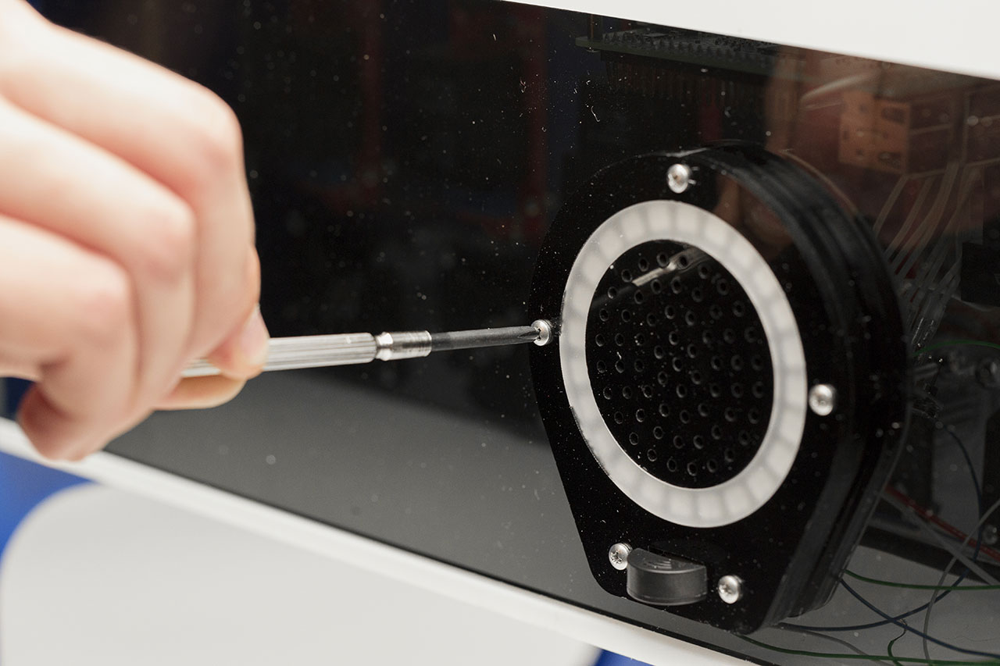

### Step 13: Attach Front Panel to Unit
Attach Front Panel to unit with 10-32 x ¾ inch length button socket cap and corresponding square nuts. There are two of these that hold the panel in place.
Tip: Use a piece of Painters tape to hold the square nuts in place until fasteners grab. Tape can be removed after through the bottle holes.

### Step 14: Attach Rear Panel to Unit
Align the Rear Panel with the corresponding slots and tabs on the rear of the unit. Once again, use the #10-32 x ¾ inch length button socket cap and respective square nuts.

## Bottle Build

### Step 15: Drill hole for tube connectors
In the lids to the carafe, drill a 1/4 inch hole for tubing. 

### Step 16: Place Bottle Assembly into Unit
Fill bottles with desired liquid, place on top of the mixer, put the lid on each carafe, feed the tubing throught the hole all the way to the bottom of the carafe. 

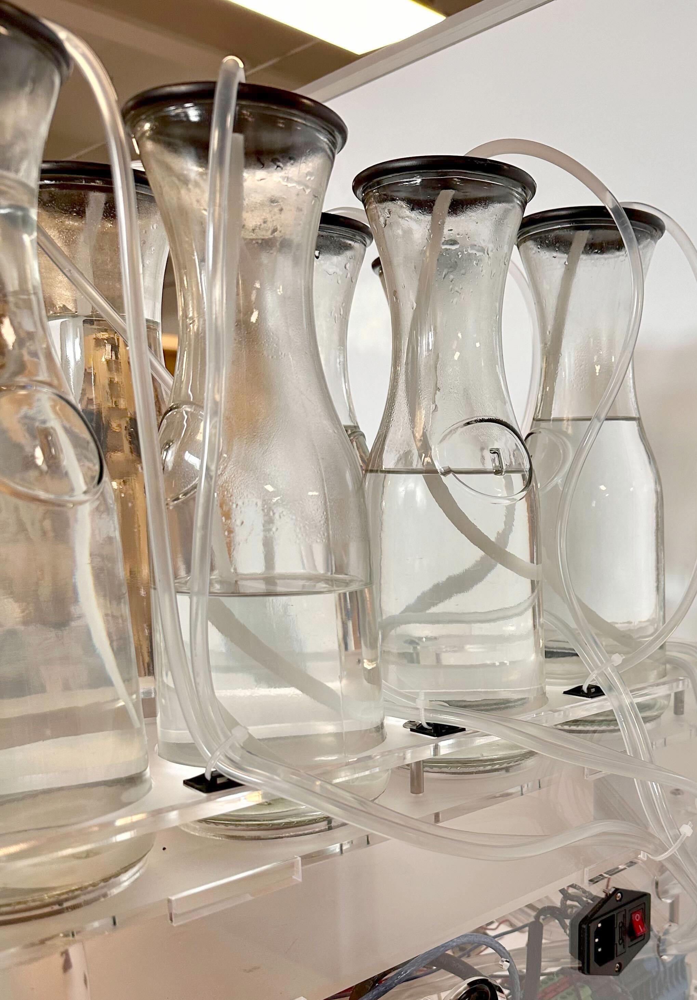

## Programming the Mixer

### Step 17: Run Javascript Program

#### Install node packages: 
‘Serialport’

‘Speech-to-text’

#### Defining Path and Variables

Declare port as new Serialport and define the path that will be used.

Upload JS program to raspberry pi and ssh into pi to initiate the program and to update the code.

Declare a variable called (‘keyword’) and set it as an empty string.

#### Initiating Program

Ssh into Pi with ssh username and password using git bash.

Type command ‘pm2 restart 0’ to refresh the program.

Cd into  ~/src/mocktailsmixer/software/rpi.

Type command ‘pm2 start index.js’ to run the program.

Type command ‘pm2 logs 0’ to view logs and observe what is happening as the program runs.

The user presses the physical button on the assembled Mocktail Mixer which triggers a serial message to be sent from Arduino to the JavaScript application

#### How Arduino sends a message to the JS program a.k.a. Button Press

A function called handleSerial() listens for a complete serial message from the Arduino to know when to parse a command.

Completed serial messages held in the variable ('data') which contains the string “button” is received from the Arduino and will be passed onto the function buttonCallBack().

Within the buttonCallBack() function there is an if statement that has the condition to use the toString() method to transfer data from the arduino into a string, and the startsWith() method to detect if “button” message has been received by the JS program. If found, it begins recording and sets a timeout for processing.

#### Speech to Text

The JavaScript application picks up the serial message through the function processTranscript() which starts streaming the audio from Speech-to-text API  with settimeout incorporated within the function to start/stop the audio recording for 10 seconds > translated to 10000 milliseconds, then the audio is transcribed.

Once the transcript is processed we then loop through an array of keywords that correspond with the drink names we have, i.e [‘mango’, ‘mechanical’, ‘mud’]  and if detected within the transcript we then calculate how many seconds each relay should be turned on and transmit those commands to arduino via serial.

#### How does the JS Program communicate to the arduino?

The buttonCallback() function calls the function keyWordToArduino(‘keyword’)  for 10,000 milliseconds, else it responds with a console.log(“don’t know that one”) 

The keyWordToArduino function has a series of if statements that will open and close the relays of each bottle depending on the correct keyword being detected.

The initial if statement will use the include() method to check if the variable 'keyword' includes a chosen keyword like 'mango' for example.
When the word 'mango' is detected, the executed code will include the port.write() method to send a string message to the arduino via serial port to open the first relay. Ex: port.write("b0r!");

Arduino Serial Commands:

          	b= bottle action
           
          	0-7 =index of bottles 
           
              r = on
              
          	l = off
           
            ! = termination
            
      a= active interaction
      
      o = off
      
Each port.write() method must have only one serial command in order to be received by arduino. Ex: to turn on and off relay number one looks like:

 port.write("b0r!")
 
 port.write("b0l!")
 

Once the first relay is open, a timeout is set to open the next relay after 1 second of the first relay being open. If you open the relays simultaneously the arduino will fail to turn either relay on because there are too many commands at one time, the 1 second setTimeOut is to avoid this problem.

After both relays are open, use the setTimeOut function to close the first relay after the number of seconds it takes to pour the proper ratio based on the drink ingredients. Nested within this setTimeOut there should be another setTimeOut that turns off the second relay after 1 second of the first relay being turned off if it is a 1:1 ratio or the proper number of milliseconds that is required based on specific drink ratios. 

For the remaining keywords, else if statements are used that follow the above pattern in the keyWordToArduino function.

An else statement is used to tell the user to try again if no keywords were detected.

Within the handleSerial() function there is a port.write(“a!”) command which communicates to the Arduino that the button press was received by the JS program and it will not allow any new button press commands to be received until the entire program has run and been completed.

### Step 18: Prepare Arduino
- Load sketch onto board.
- Connect to Raspberry Pi via USB.

### Step 19: Run system
- Ensure you are still in the Python virtual environment. If not: `$ cd && source env/bin/activate`.
- Change directory: `$ cd /home/pi/embedded-assistant-sdk-python`
- Run the auth_helper to create an authorization file: `$ python -m googlesamples.rpi.auth_helpers --client-secrets /home/pi/client_secret_*.json`.
- Run the system `$ python -m googlesamples.rpi`.

### Step 20: Configure your own drinks
- Using the api.ai web console, update the agent’s @drink entity and make_drink intent to reflect the drink names.
- On your Raspberry Pi, update the DRINK_SIZE, MENU and NUM_BOTTLES variables in bartender/\_\_main\_\_.py.

### Step 21: Troubleshooting
- If the LEDs or relays are not working, check the SER_DEVICE variable in bartender/\_\_main\_\_.py.

## Cleaning Your Mixer

- After use, empty your bottles from earlier contents and rinse with water.
- Fill each bottle with water and run Mixer to clean lines of any residue that may be left behind. This will keep the Mixer clean and ready for the next time you change liquids.
- Run the Mixer pumps until no liquid can be seen coming out. This will ensure no liquid is left in the lines.
- Remove bottles from Mixer and allow them to dry after rinsing them out.
- Periodically check all hoses and connections to prevent leaks from developing.
